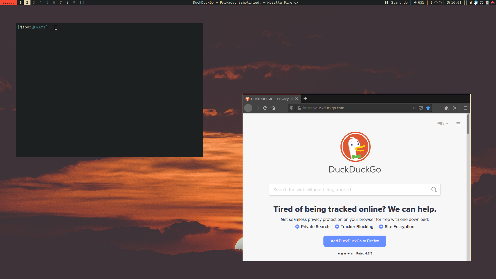

# MoonWM

<!-- START doctoc.sh generated TOC please keep comment here to allow auto update -->
<!-- DO NOT EDIT THIS SECTION, INSTEAD RE-RUN doctoc.sh TO UPDATE -->
**Table of Contents**

- [Usage](#usage)
  - [Most important shortcuts](#most-important-shortcuts)
  - [Quick help](#quick-help)
  - [Setting up different screen layouts](#setting-up-different-screen-layouts)
- [Customizing](#customizing)
  - [Setup personal defaults](#setup-personal-defaults)
  - [Customize WM settings](#customize-wm-settings)
  - [Set custom colours with xrdb](#set-custom-colours-with-xrdb)
  - [Autostart](#autostart)
  - [Creating your own status script](#creating-your-own-status-script)
- [Details](#details)
  - [Default tags](#default-tags)
  - [Available layouts](#available-layouts)
  - [Dependencies](#dependencies)
  - [Patches implemented](#patches-implemented)
- [Forking](#forking)
- [Credits](#credits)

<!-- END doctoc.sh generated TOC please keep comment here to allow auto update -->


**Screenshot:** 

**Packages:** `aur/moonwm`, `aur/moonwm-git`

**Installation from source:**
```sh
sudo make install install-scripts clean
```

## Usage

### Most important shortcuts
* `MOD + d` **Open Application**
* `MOD + 1-9` **Switch Tag**
* `MOD + Shift + q` **Close Application**
* `MOD + F11` **Help Menu (see below)**

Use **hjkl** or **arrow keys** for `<direction>`:
* `MOD + <direction>` **Focus Client**
* `MOD + Shift + <direction>` **Move Client**
* `MOD + Control + <direction>` **Resize Client**

### Quick help
**For a quick interactive help page press MOD(Win)+F11.
You will get a interactive list with shortcuts and their corresponding actions.
You can also directly select most of the entries to execute their action.**

### Setting up different screen layouts
To setup your monitors use the graphical tool `arandr` (`MOD+F10`).
It lets you create and save a layout in `~/.screenlayouts` from where you can load your layouts either with `arandr` or with dmenu/rofi by pressing `Mod+Shift+F10`.
On startup MoonWM loads the `autoload.sh` setup if it is available.
If it isn't MoonWM automatically arranges the monitors next to each other with their native resolutions.
This is done by `moonwm-util` and can be called with `moonwm-util screensetup`.


## Customizing
Most of MoonWMs defaults are overwriteable through environment variables, xrdb or similar methods.
There is no real configuration file.
If you want to change something more sophisticated, like replacing `moonwm-util` consider forking the git repository (see below).

### Setup personal defaults
MoonWM is configured through environment variables.
You can place them in the **config file** `~/.config/moonwm/config.env` in the format shown below.
These are automatically loaded, exported and reloaded on restart.
(Environmental variables set and exported in `~/.profile` or similar will work too, but the config file is the preferred method.)

MoonWM tries to use **sensible defaults** for all settings.
But you might want to customize the **keyboard layout**, **wallpaper**, etc.:
```sh
MOONWM_KEYMAP="us"
MOONWM_WALLPAPER="~/path/to/wallpaper.jpg"
MOONWM_MODKEY="Super"            # defaults to Alt
TOUCHEGG_THRESHOLD="750 750"     # if you are using touchegg
```

In addition you can explicitly define your **default applications** like a terminal or browser.
MoonWM will automatically look for defaults if they are not set.
```sh
BROWSER="firefox"
FILEMANAGER="pcmanfm"
TERMINAL="alacritty"
DMENUCMD="rofi -show drun"
```

### Customize WM settings
To even further customize your keyboard you can put a file with `xmodmap` expressions in `~/.config/moonwm/modmap`.
It will be evaluated automatically.
Or you can add `setxkbmap` options to your configuration like so:
```sh
MOONWM_KEYMAP="us,de -option -option grp:lalt_switch"
```

You can disable certain autostarts of the `moonwm-util` **autostart** routine.
This is useful if you for example have your own wrapper scripts or other replacements:
```sh
MOONWM_NOTIFYD=0      # disables the notification daemon
MOONWM_PICOM=0        # disables picom
```

With these settings you can turn features on or off (with their default values):
```sh
MOONWM_KEYS=1           # enable/disable internal moonwm key handling
MOONWM_TOGGLELAYOUT=0   # toggle layout when its already set
MOONWM_WORKSPACES=0     # use workspaces like i3 instead of tags (experimental)
# bar
MOONWM_SHOWBAR=1        # show a bar
MOONWM_SYSTRAY=1        # show system tray icons
MOONWM_TOPBAR=1         # place bar at the top or bottom
# clients
MOONWM_SMARTGAPS=1      # disable gaps when only one client is visible
MOONWM_RESIZEHINTS=0    # let clients choose their size when tiled
MOONWM_CENTERONRH=0     # if resizehints applies, center the window
MOONWM_DECORHINTS=1     # decoration hints (MOTIF)
# handled by moonwm-util launch
MOONWM_PICOMEXP=0       # start picom with --experimental-backends flag
MOONWM_THEMEDDMENU=1    # automatic dmenu theming
MOONWM_THEMEDXMENU=1    # automatic xmenu theming
```

You can also customize these settings (these are the defaults), which all take unsigned integer arguments:
```sh
MOONWM_BORDERWIDTH=5    # width of the window borders
MOONWM_FRAMERATE=60     # frame rate when dragging windows; should be >= monitor refresh rate
MOONWM_GAPS=5           # gaps; 0 to disable gaps
MOONWM_MFACT=55         # master size ratio; must be between 5 and 95
```

### Set custom colours with xrdb
Custom values for colors and some other properties can be set via `xrdb(1)`.
To edit the design simply add/change these values in your `~/.Xresources`:
```yaml
moonwm.focusedBorder:      #ebdbb2
moonwm.focusedTitleBg:     #1d2021
moonwm.focusedTitleFg:     #ebdbb2
moonwm.menuBg:             #fb4934
moonwm.menuFg:             #1d2021
moonwm.occupiedTagBg:      #1d2021
moonwm.occupiedTagFg:      #ebdbb2
moonwm.statusBg:           #1d2021
moonwm.statusFg:           #ebdbb2
moonwm.unfocusedBorder:    #1d2021
moonwm.unfocusedTitleBg:   #1d2021
moonwm.unfocusedTitleFg:   #7c6f64
moonwm.vacantTagBg:        #1d2021
moonwm.vacantTagFg:        #7c6f64
```

You should also edit the according xmenu and general entries to get everything to fit together:
```yaml
*background:            #1d2021
*foreground:            #ebdbb2

xmenu.border:           #1d2021
xmenu.selbackground:    #ebdbb2
xmenu.selforeground:    #1d2021
```

### Autostart

On login or reload `moonwm-util` starts a bunch of useful programs by default.
You can find a list of "essential" utilities that are started automatically [below](#Dependencies).
In addition these programs get started, provided you have installed them:
```
nextcloud       # cloud for your data
redshift        # make screen less blue at night time
touchegg        # touch gestures
kdeconnect      # interaction with your mobile phone
```


If you wish to run any of your own scripts: `~/.local/share/moonwm/autostart.sh` and `~/.local/share/moonwm/autostart_blocking.sh` are run on each startup if available and executable.

### Creating your own status script
The built-in `moonwm-status` script should be a good foundation for making your own statuscmd.
It is easily extensible and you can simply add blocks with `add_block` in the `get_status` function.
Make sure to escape '%' though, as it is interpreted by printf as escape sequence.

To setup your own status command you should also set the according env variable in your `~/.profile`:
```sh
export MOONWM_STATUSCMD="/path/to/my/statuscmd"
```
This command gets asynchonously on MoonWMs startup with `loop` as the first parameter.
It should then repeatedly set the status to the WM_NAME (for example with `xsetroot`).
Make sure to add in a `sleep` so it doesn't unnecessarily wastes resources.

You can also define clickable blocks actions delimited by ascii chars that are smaller than space.
For example:
```
date: 11:05 |\x01 volume: 55% |\x02 cpu-usage: 21% ||
```
Once you press one of the blocks the statuscmd script will be called with `action` as its first parameter.
The according mouse button will be set as `$BUTTON` and the block number as `$STATUSCMDN`.

The standard MoonWM status interface also includes the `update` parameter, which tells the bar to immediately refresh.
`status` as first parameter prints out the current statusline to stdout.


## Details

### Default tags
Some applications have default  tags they open on:
```
5:      Jetbrains IDEA
7:      Discord, Teamspeak
8:      Spotify
9:      Thunderbird
```
If you want alternative replacements added to the rules please tell me.

### Available layouts
* bstack
* centeredfloatingmaster (disabled)
* centeredmaster (disabled)
* deck
* dwindle (disabled)
* fibonacci (disabled)
* spiral (disabled)
* tile
* tileleft

### Dependencies
All packages are listed with their names in the Arch or Arch User Repositories.

**These are the ones required by the MoonWM build itself:**
```
libx11
libxcb
libxinerama
slop
xmenu
xorg-xsetroot
```
**These are the ones the `moonwm-util` script uses, starts or other programs I deem essential for a working desktop interface:**
```
arandr          # gui to setup screens
dmenu           # (application) menu
ffmpeg          # playing sounds
geoclue         # location services
i3lock          # screen locking
imagemagick     # lock screen generation
libnotify       # desktop notifications
light           # change background light of screen
network-manager-applet      # network management
otf-nerd-fonts-fira-code    # default font
pamixer         # volume manipulation
picom           # compositor
polkit-gnome    # security policy agent
skippy-xd       # application overview
wmname          # change wmname for Java compatibility
xdotool         # wm interaction
xfce4-power-manager         # power management
xorg-setxkbmap  # set keyboard layout
xorg-xrandr     # setup screens
xorg-xrdb       # interaction with xres database
xwallpaper      # set wallpaper
```
You may want to use `rofi-dmenu` as a provider for `dmenu` if you use rofi.

### Patches implemented
* actualfullscreen
* alpha (fixborders)
* attachaside
* autostart
* centeredwindowname
* cyclelayouts
* deck
* deck-tilegap
* decorhints
* dwmc
* ewmhtags
* fixborders
* focusdir
* focusonnetactive
* layoutmenu
* pertag
* placemouse
* riodraw
* restart
* savefloats
* shiftview/shiftviewclients
* stacker
* statusallmons
* statuscmd
* swallow
* systray
* vanitygaps
* warp
* xrdb


## Forking
You are encouraged to fork this project.
At the moment `config.def.h` might be a little outdated, so you are probably better off just editing `config.h`.
However please consider the project is not "suckless" neither is that its goal.
MoonWM should mostly be compatible wtih dwm patches although the huge amount of patches already applied make it a little hard and due to the code being relocated to `src/` you will have to patch them manually.


## Credits
* to **Guzman Barquin** for the moon in the title image
